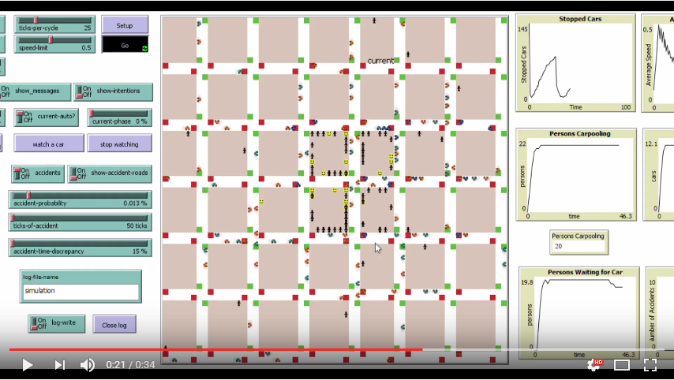
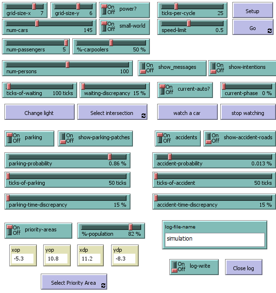

# Carpool Simulation in Netlogo

## Index

1. [Description](#description)
2. [What is Carpooling?](#what-is-carpooling)
3. [Problem](#problem)
4. [Controls](#controls)
5. [Scenarios](#scenarios)
    1. [Low density scenario](large-scenario-with-no-population-density)
    2. [High density scenario](large-scenario-with-population-density)
6. [Analisys](#analysis)
7. [Conclusions](#conclusions)
8. [Developers](#developers)

## Description 

This project was developed under the **Systems Modelling and Simulation** course @ FEUP. For a more concrete information you can read the project [scientific paper](./report/simulation-carpool-system.pdf). We used a **BDI like** and a **FIPA like** frameworks in order to control and exchange messages bettween the several simulation agents.

## What is Carpooling?

Carpooling (or car-sharing) is the sharing of car journeys so that more than one person travels in cars. This type of transportation method has several advantages, being however hard to implement such a system in a real life situation because of the lack of research involving this area. The project that we describe in this paper has the purpose of addressing the problem about the integration of a carpool system in an artificial road traffic network using NetLogo. By simulating all the needed variables in order to achieve said system, and by plotting and documenting the gathered results, we found several conclusions which we deemed interesting, such as how more densely populated areas have a higher relationship between the number of people wanting a carpool and the number of people actually offering a carpool, or how accidents heavily influence the road traffic network.

## Problem

This project intends to answer whether or not, and in which conditions, does a carpooling system works among a society which uses the same roads to travel on their everyday lives. The problem we want to answer might be defined as the following question:

**_Under which conditions is a society capable of efficiently serve its citizens with a carpooling system?_**

## Controls

The simulation can be controlled by adjusting all kind of **input variables** such as the ones we can see in the following image.

## Scenarios

To test how the system plots fluctuate in similar conditions with small changes in its environment, we maintained some variables unaltered, such as the grid size, traffic light existence, speed limit, maximum number of passengers allowed in a car and the percentage of cars who does carpooling. The values which we admitted were: grid size of a 7 per 7 matrix, percentage of carpoolers as 60\% of the total existing cars and 5 seats existing in every car (which means a total of 4 available seats for carpooling excluding the driver). We will also assume that, in the presence of a more densely populated area, the total percentage of population existing in that area is of 80\%. Besides that, we will also assume for this analysis that, in case of a car parking or a traffic accident, the average number of waiting ticks is 50 (meaning the system considers the aforementioned situations for an average number of 50 time units).

#### Large scenario with no population density

#### Large scenario with population density

## Analysis

The observer has also access to a myriad of plots and numbered information where it can evaluate various aspects about the simulation as time passes. These slots are constantly updating themselves, ending when the simulation also ends.

## Conclusions

By considering the analyzed data through the six tests we conducted (described in the previous section), we were able to check how different situations, when related with each other, although minimal at first, can influence the outcome of many variables in the system of which we wouldn't even be counting. With all the mess that a big crowd of people and cars provoke observed from above, with people constantly and almost instantaneously being generated, searching for carpoolers or giving up their hopes of finding a suitable service, we could not perceive how a simple difference in population density influences the percentage of people being served by the carpooling system by almost two times. This simulation projects greatly help to understand how social and other type of phenomena work.

## Developers

| [António Pedro Fraga](https://github.com/pedrofraga) | [Luís Oliveira](https://github.com/luisoliveira8) | [Pedro Martins](https://github.com/esquilofeup) |
| ------------- | ------------- | ------------- |
|   |  |   |
| antoniopedrofraga@gmail.com | luisoliveira8c@gmail.com | pedrovlmartins@gmail.com  |

